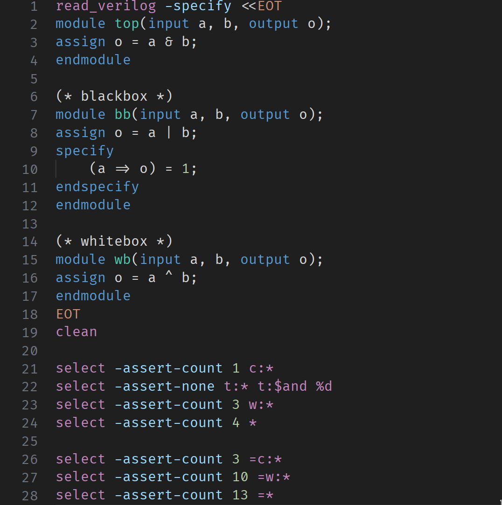
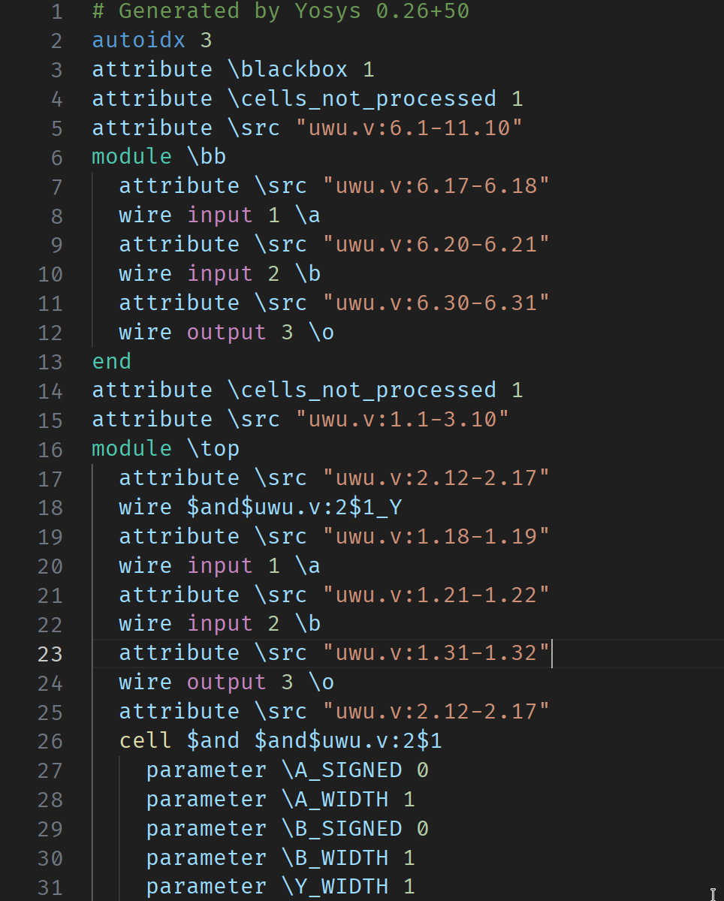

# Yosys + RTLIL Syntax Highlighting

This VSCode extension adds syntax highlighting support for [Yosys](https://github.com/YosysHQ/yosys). Adding both RTLIL and Yosys script support.

## License

This VSCode extension is licensed under the [BSD-3-Clause](https://spdx.org/licenses/BSD-3-Clause.html) license, the full text of which can be found in the [`LICENSE`](./LICENSE) file.
